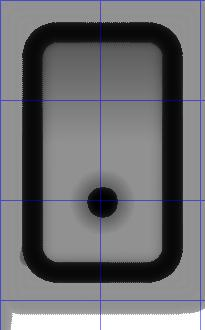
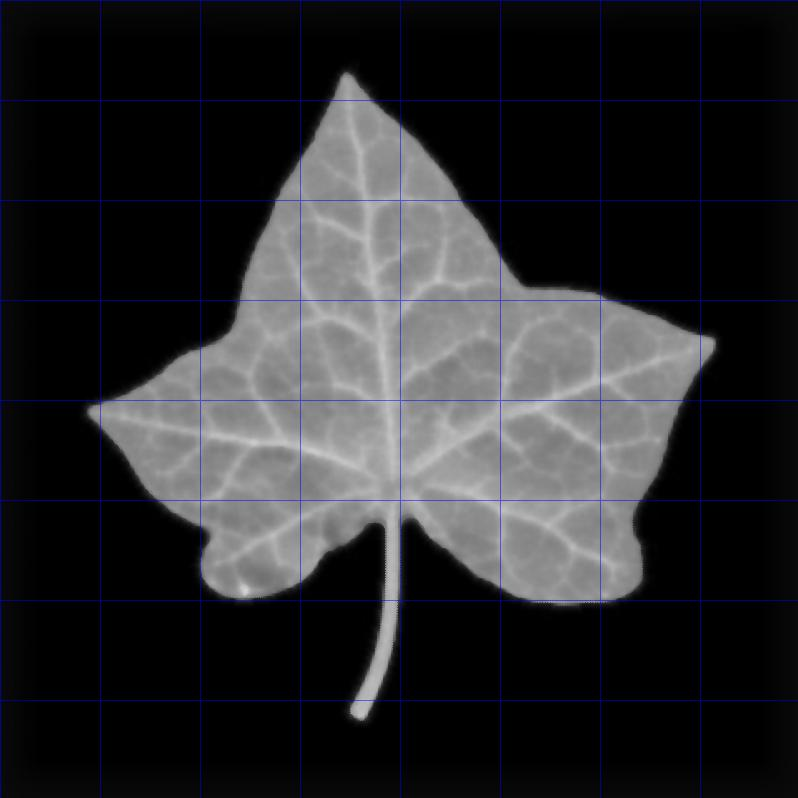

# nc2image.py

I wrote this so I can see what gcode files designed for a 3-axis cnc machine look like. There are programs and websites that will show you the toolpath (in 3D), but it is hard to see the resulting surface shape. This program prepares an image (JPEG) where the greyscale represents the depth of the cut.

The output image looks like this:

This image is created from example2.nc. The white area has not been machined. The greyscale shows the cuts, with the black being the deepest, normally to the bottom of the material.

I also wanted to test copilot to see how well it can write code and 99% of this is from copilot. (It needed a lot of help to get it right, but it does show you can make programs without doing any programming yourself.)

To use the software:

1. Name your file example.nc
2. Download nc2image.py
3. Run **python nc2image.py**

You should get a file called "example.jpg", which you can view. Note:

* You will need python 3 installed
* You will need numpy, tqdm, re and PIL
* I've not made command line options, modify the python code variables:
* **px2mm** sets the resolution. Default 10 means 10 pixels per mm (0.1mm resolution)
* **tool_diameter_mm** sets the tool diameter in mm. Default 2.0 means a 2mm cutter. I have only programmed a ball cutter.
* **material_top_height** sets the height of the top of the material. Tool movement above this height will not affect the image. Default 0 means all cuts will be negative and all positive z-value moves will not cut. (I've only tested 0.)
* **step_mm** sets the step for the cutter. Rather than drawing lines for each gcode move, the program assumes that the cutter "jumps" in steps. This probably isn't the most mathematically correct technique. I tried drawing lines to begin with but it took about an hour whereas this takes about 10s (for example.nc).
* **gcode_file** can be changed to match your input file, or just rename your input file.
* **output_file** can be changed too, but you could rename the default file name instead. I use JPG output format and I've set the dpi correctly. If you load the file into, say, GIMP, and set GIMP to show the cursor position in mm, you can check the dimensions of your gcode.

Here is the leaf image, turned into gcode using image2cnc.py (see https://github.com/s7711/image2cnc/tree/main), then returned to a JPEG using nc2image.py

As always, don't trust this software. Check everything yourself. Good luck, enjoy.